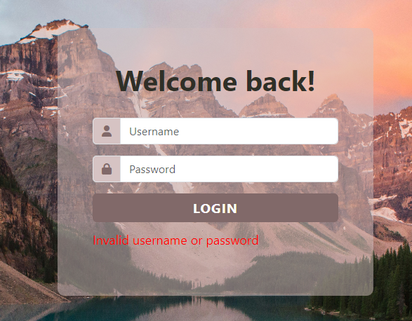
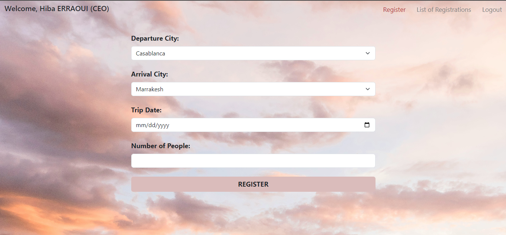
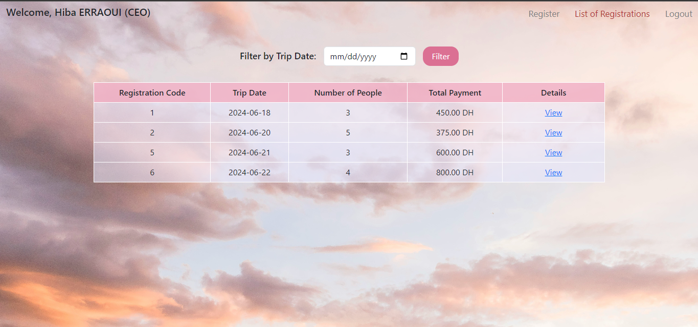

## Description
This repository contains the source code for an employee trip registration system developed using PHP. The system is designed to allow employees to register for company-organized trips along with their families. It provides a user-friendly web interface for managing trip registrations, including authentication, registration form submission, and trip details viewing.

## Features
♡ &nbsp;  User Authentication: Employees can log in securely using their username and password.  
♡ &nbsp;  Registration Form: A form is provided for employees to enter details such as departure city, arrival city, trip date, and number of people accompanying them.  
♡ &nbsp;  Trip Details: Employees can view detailed information about their registered trips, including trip date, departure city, arrival city, departure time, and calculated arrival time.  
♡ &nbsp;  Filtering: The system allows employees to filter their registrations based on trip date.  
♡ &nbsp;  Logout: Employees can securely log out of the system when they are done.  

## Screenshots

